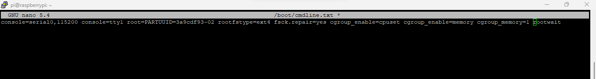

# Node-RED Docker Stats
A simple Node-RED project that shows stats for different docker containers. It is dependent on Portainer as middleware.

> You need to have a working portainer container and related auth creds to use this.

> If you are using Rasapberry Pi as docker host. To enable memory reporting (If memory stats is not showing up), make the following changes to `cmdline.txt` file in `boot` folder.

You can find the complete flow here: http://bit.ly/42RrM6u
